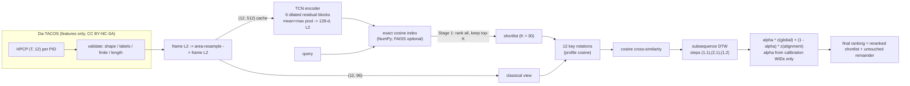

# Structure-Aware Hybrid Retrieval for Cover Song Identification

A reproducible music-information-retrieval system that finds **cover versions** (other recordings of the same composition) on the [Da-TACOS](https://mtg.github.io/da-tacos/) dataset, using only pre-extracted **HPCP** (chroma) features.

It is a two-stage hybrid:

1. **Stage 1 — learned global retrieval.** A compact temporal-convolutional encoder maps a whole track to one 128-d unit vector; exact cosine search ranks every candidate and keeps a shortlist of K = 30.
2. **Stage 2 — structure-aware classical reranking.** For each shortlisted pair, choose the best of 12 key rotations, build a cosine-distance cross-similarity matrix, run slope-constrained **subsequence DTW**, and blend the alignment score with the global score. The blend weight is calibrated only on held-out calibration works.

Everything is deterministic from committed configs and ID-only manifests, tested with `pytest`, and runnable from a fresh clone.

> **Headline finding.** The first benchmark evaluation was a negative result: exhaustive classical alignment beat the two-stage hybrid **4.6x** (MAP 0.084 vs. 0.018), reversing what a 20-query development protocol had suggested. Four follow-up experiments — hubness correction, 384-frame reranking, training on all 4,780 works, and longer training — raised the hybrid **6.8x** (0.018 → 0.122) and Stage 1 **7.6x** (0.010 → 0.076), narrowing the gap to the best system (0.136, corrected exhaustive alignment) to **1.11x** at 38 ms per query versus 2.63 h. The binding constraint throughout was Stage-1 shortlist recall, which rose 0.021 → 0.136. Accuracy remains below published CSI systems. See [Results](#results) and [reports/improvement_experiments.md](reports/improvement_experiments.md).

---

## Problem

Cover song identification (CSI) is a **retrieval** problem: given a query recording, rank a collection so that other versions of the same work come first. Covers change key, tempo, structure, instrumentation and vocals, so neither raw spectral similarity nor exact matching works. Relevance is defined only by the SecondHandSongs *work* ID (WID); each recording has a performance ID (PID).

## System



| Component | Classical or learned | Where |
|---|---|---|
| HPCP loading, validation, orientation, normalisation, resampling | classical | `src/cover_retrieval/data/datacos.py`, `features/` |
| 12-rotation key invariance | classical | `alignment/transposition.py` |
| Cross-similarity + DTW / subsequence DTW (reference with backtracking, plus a batched PyTorch version) | classical | `alignment/csm.py`, `alignment/dtw.py` |
| TCN encoder, SupCon / triplet losses, deterministic training | learned | `models/` |
| Exact embedding index, hybrid reranking, alpha calibration | glue | `retrieval/` |
| Metrics, work-level bootstrap, error analysis, plots | evaluation | `evaluation/` |

The alignment code is written from the textbook DTW recurrence (FMP §3.2). No cover-song library is imported, and no code comes from the AGPL-licensed `acoss`.

## Setup

Python 3.11 or newer (developed on 3.12).

```bash
git clone <this repo> && cd cover-version-retrieval
python3.12 -m venv .venv && source .venv/bin/activate
pip install -e ".[dev]"          # add ".[faiss]" for the optional FAISS backend
pytest                            # 112 tests, including the synthetic end-to-end pipeline
```

## Data

Da-TACOS has no audio. This project needs the metadata (for WID/PID identifiers) and the HPCP features, about 17 GB of ZIP archives in total. Everything lands in `data/external/`, which is git-ignored. Licensing and leakage rules are in [DATASET_CARD.md](DATASET_CARD.md).

```bash
# metadata (3.5 MB)
python scripts/download_datacos.py --what metadata

# fast link: whole HPCP archives (MD5-verified, needs >= 35 GB free while unpacking)
python scripts/download_datacos.py --what coveranalysis_hpcp benchmark_hpcp

# slow link: only the files the manifests need, via HTTP range requests (resumable, CRC-checked)
python scripts/download_datacos.py --fetch-members coveranalysis --config configs/base.yaml
python scripts/download_datacos.py --fetch-members benchmark --config configs/base.yaml
```

## Running

All commands run from the repository root.

```bash
python scripts/build_manifests.py        --config configs/base.yaml               # deterministic WID-disjoint splits
python scripts/profile_data.py           --config configs/base.yaml --include-benchmark
python scripts/run_classical_baseline.py --config configs/classical_baseline.yaml --resolution-sweep 48 192 384
python scripts/train_encoder.py          --config configs/hybrid_dev.yaml
python scripts/run_hybrid_retrieval.py   --config configs/hybrid_dev.yaml          # calibrates + locks alpha, dev evaluation
python scripts/analyze_hubness.py        --config configs/hybrid_dev.yaml          # analysis only
python scripts/run_benchmark.py          --config configs/benchmark.yaml --with-alignment-only   # FINAL test
```

Improvement experiments ([reports/improvement_experiments.md](reports/improvement_experiments.md)):

```bash
# 1. hubness correction: lambda/method calibrated on calibration works
python scripts/run_hubness_correction.py --config configs/hybrid_dev.yaml
# 2. 384-frame reranking (base default stays 96)
python scripts/run_hybrid_retrieval.py   --config configs/hybrid_dev.yaml --set features.n_frames=384 --tag n384
# 3. encoder on every usable Cover Analysis work
python scripts/build_manifests.py        --config configs/full_train.yaml
python scripts/train_encoder.py          --config configs/full_train.yaml
# combined system, final benchmark
python scripts/run_benchmark.py --config configs/full_train.yaml --tag full384 \
    --set features.n_frames=384 --hub-correction reports/results/hubness_correction_n384.json
```

Smoke test on **synthetic** data, which exercises every script. Its outputs go to `runs/smoke/`, never `reports/`:

```bash
PYTHON=python ./scripts/run_smoke.sh
```

Notebook: `notebooks/01_feature_and_alignment_inspection.ipynb`, regenerated by `scripts/build_notebook.py`. It imports library functions only.

## Project layout

```
configs/          base.yaml (+ classical_baseline, hybrid_dev, benchmark, full_train, smoke)
data/manifests/   committed ID-only manifests (splits, protocols, exclusions)
data/external/    Da-TACOS downloads (git-ignored)
src/cover_retrieval/
  data/           datacos.py, manifests.py, splits.py, remote_zip.py, synthetic.py
  features/       hpcp.py, preprocessing.py (validated, fingerprinted feature cache)
  alignment/      transposition.py, csm.py, dtw.py
  models/         tcn_encoder.py, losses.py, training.py
  retrieval/      index.py, rank.py, hybrid.py, normalization.py (hubness correction)
  evaluation/     metrics.py, analysis.py
  utils/          io.py, seed.py
  pipeline.py     shared building blocks used by the scripts
scripts/          download, manifests, profiling, training, evaluation, smoke, notebook
tests/            unit, property and end-to-end tests
reports/          dataset_profile, classical_baseline, hybrid_results, error_analysis,
                  improvement_experiments (+ results/, figures/)
notes/            decisions.md (D-001 onward), papers/
web/              interactive research site (static React + Vite; see web/README.md)
```

**Website.** `web/` is a static, interactive walk-through of the system and every result above, built only from committed files in `reports/` (no audio, no restricted data). `cd web && npm ci && npm run dev`; deployable on Vercel with `web` as the project root, or to GitHub Pages via `.github/workflows/web.yml`.

## Reproducibility controls

* **Fixed seed** `20260817` for split permutation, batch order, augmentation and initialisation (`utils/seed.py`). Training runs on CPU with `torch.use_deterministic_algorithms` and a fixed thread count; a test checks that two runs give bit-identical weights.
* **Frozen protocols.** Committed manifests list every selected WID/PID and role. Rebuilding them is byte-identical (tested). Candidates are sorted by PID, so score ties break deterministically.
* **Fingerprinted caches.** Preprocessed features are keyed by a hash of the track list and every preprocessing setting.
* **Locked evaluation settings.** The encoder checkpoint is chosen on validation works, and alpha/K on calibration works; both are written to `reports/results/hybrid_calibration.json` before any development or benchmark query is scored. `run_benchmark.py` refuses to run without that file and tunes nothing.
* **Provenance.** Every result JSON records the git commit and config path.

## Results

### Development protocol (Da-TACOS Cover Analysis, 20 queries x 120 candidates)

One relevant item per query, self excluded, so **AP = reciprocal rank and MAP = MRR by construction**. A random ranking scores about 0.045 MAP. Every setting was locked before the run; alpha and K come from calibration works only.

| system | MAP (= MRR) | Hit@1 | Hit@10 | mean first rank |
|---|---|---|---|---|
| global embedding (Stage 1 only) | 0.189 | 0.10 | 0.35 | 23.5 |
| global embedding + test-time rotations | 0.200 | 0.10 | 0.55 | 20.6 |
| classical alignment over all candidates | 0.248 | 0.15 | 0.45 | 31.3 |
| **hybrid (K = 30, alpha = 0.05)** | **0.262** | 0.15 | **0.55** | **20.8** |
| rerank only (K = 30, alpha = 0) | 0.265 | 0.15 | 0.55 | 20.6 |

Paired work-level bootstrap (10,000 resamples), ΔAP [95% CI]: hybrid − global **+0.073 [−0.000, +0.178]**; rerank-only − global **+0.076 [+0.003, +0.181]**; hybrid − classical +0.014 [−0.009, +0.042]. With 20 queries only the rerank-only gain over Stage 1 clears zero, and barely. Reranking 30 of 119 candidates matches full alignment while doing a quarter of the alignment work.

Classical ablations: no key handling 0.303, profile-selected rotation 0.248, exhaustive 12-rotation DTW 0.248, profile-only (no temporal model) 0.266 — all mutually indistinguishable at this sample size. Details and the resolution sweep (MAP rises to 0.384 at 384 frames) are in [reports/classical_baseline.md](reports/classical_baseline.md).

Encoder: 645,504 parameters, trained on 1,500 works, selected by validation MAP over 4 variants (best 0.181 on 150 disjoint validation works); see [reports/hybrid_results.md](reports/hybrid_results.md).

**Main error mechanism (hubness).** Tonally static tracks attract low DTW cost from everything. Across the 120 candidates, tonal dispersion vs. top-10 false-positive count gives Spearman ρ = −0.77 (classical) and −0.57 (hybrid); the worst hub is a false positive for 11 of 20 queries where 1.7 is expected. See [reports/error_analysis.md](reports/error_analysis.md).

### Final Da-TACOS benchmark (13,000 queries x 15,000 candidates)

Three benchmark evaluations, each with every setting locked beforehand (encoder chosen on validation works; alpha, lambda and resolution on calibration works). No benchmark result selected anything. 12 relevant items per query; random ≈ 0.0008 MAP.

Four evaluations, each with every setting fixed beforehand (encoder from validation works; alpha, lambda and resolution from calibration works). No benchmark result selected anything, and no run was repeated after seeing its result.

| system | encoder | frames | hub corr. | MAP | MRR | Hit@10 | median first rank |
|---|---|---|---|---|---|---|---|
| global embedding (Stage 1) | 1,500 works, 60 ep | — | — | 0.010 | 0.052 | 0.096 | 185 |
| hybrid K=30 | 1,500 works, 60 ep | 96 | no | 0.018 | 0.124 | 0.154 | 185 |
| global embedding | full, 60 ep | — | — | 0.034 | 0.130 | 0.243 | 59 |
| hybrid K=30 | full, 60 ep | 384 | yes | 0.068 | 0.301 | 0.343 | 59 |
| global embedding | **full, 150 ep** | — | — | 0.076 | 0.297 | 0.373 | 23 |
| hybrid K=30 | full, 150 ep | 384 | no | 0.113 | 0.373 | 0.443 | 23 |
| **hybrid K=30** | **full, 150 ep** | **384** | **yes** | **0.122** | **0.402** | **0.462** | **21.5** |
| classical alignment (all pairs) | — | 96 | no | 0.084 | 0.282 | 0.352 | 77 |
| **classical alignment (all pairs)** | — | **96** | **yes** | **0.136** | **0.397** | **0.481** | **14** |

Work-level bootstrap over 1,000 cliques, ΔAP vs. the matching Stage 1: hybrid + hub (150 ep) **+0.0457 [+0.0426, +0.0487]**; classical + hub **+0.1013 [+0.0936, +0.1090]**. All intervals exclude zero.

**What the four follow-up experiments bought:** Stage-1 MAP 7.6x, hybrid MAP 6.8x, best system 1.6x, shortlist recall 0.021 → 0.136, median rank of the first correct cover 185 → 21.5 (hybrid) and 77 → 14 (classical). The hubness correction — predicted from a development-set correlation (tonal dispersion vs. false positives, ρ = −0.77), calibrated on 10 works, one scalar — transfers cleanly to benchmark scale and helps every system.

**Revised architectural verdict.** Each improvement to Stage 1 narrowed the hybrid's deficit: 4.6x → 2.2x → 2.0x → **1.11x**. The two-stage design is not vindicated — exhaustive corrected alignment is still the most accurate system, and the untested classical 384 + hub configuration (about 42 h of CPU) would likely widen that lead — but the original negative result was as much about a weak Stage 1 as about the architecture, and shortlist recall (now 0.136) remains the measured constraint.

Full tables, runtimes and analysis: [reports/improvement_experiments.md](reports/improvement_experiments.md), [reports/hybrid_results.md](reports/hybrid_results.md).

### Synthetic smoke pipeline

`scripts/run_smoke.sh` exercises every script end to end on a synthetic fixture. Its numbers are **not** Da-TACOS results and are written to `runs/smoke/`, never to `reports/`.

### Reproducibility evidence

From a fresh clone with the same data, the manifests rebuild byte-identically, the classical rankings and metrics match exactly, and retraining the encoder reproduces the selected checkpoint **bit-for-bit** (epoch 50, validation MAP 0.18097, identical weights).

## Limitations

* **Absolute accuracy remains below published CSI systems** on this benchmark, despite a 7x improvement in the best system over the first run. The classical stage still aligns at 96 frames at full-catalogue scale (D-005), and the encoder, though now trained on all 4,780 works, had not converged when training stopped at 60 epochs.
* **Stage 1 is still the binding constraint.** Shortlist recall improved from 0.021 to 0.072 at K = 30, but the hybrid cannot retrieve what the shortlist omits.
* **The strongest likely system was not run:** classical alignment at 384 frames with hubness correction (about 42 h of CPU).
* **Test-time rotation matching** was never carried to the benchmark, so its benefit at scale is unmeasured (on development it helped the weaker encoder, 0.394 → 0.436, and was neutral for the stronger one, 0.572 → 0.566).
* **The development protocol proved unrepresentative twice** (D-022): it got the hybrid-vs-classical ordering wrong, and with a strong Stage 1 it said reranking hurts while the benchmark showed it helps. Treat its numbers as plumbing checks and hypotheses, not evidence.
* **Pilot resolution.** The classical stage averages each track down to 96 frames (D-005), which blurs harmonic rhythm. The resolution sweep in `reports/classical_baseline.md` shows how much this costs: dev MAP rises from 0.248 at 96 frames to 0.384 at 384.
* **Small development protocol.** 20 queries against 120 candidates; bootstrap intervals are wide, and dev-set differences whose interval spans zero are not claimed as improvements. It also proved unrepresentative: its system ordering did not survive at benchmark scale.
* **Training data budget.** The encoder was trained on 1,500 of the roughly 4,800 usable Cover Analysis works, because of a 0.3–0.45 MB/s link (D-010). With two recordings per work, supervision is thin.
* **Asymmetric, whole-query alignment.** Subsequence DTW aligns the entire query; a cover that drops or reorders sections is penalised. Serrà-style local alignment (Qmax) is not implemented.
* **Dataset scope.** Da-TACOS is feature-only, from 2019, and Western-pop-centric. Nothing here establishes robustness to short or partial queries, live or user-generated recordings, or production-scale catalogues.

## Next research directions

Ordered by what the benchmark evidence actually demands:

Items 1–3 of the earlier list were carried out; see [reports/improvement_experiments.md](reports/improvement_experiments.md). What remains, ordered by the evidence:

1. **Keep pushing Stage-1 recall**: validation MAP was still drifting upward at epoch 150, and shortlist recall (0.136) still caps the hybrid. More epochs, larger K, and multi-vector (per-section) embeddings are the obvious moves.
2. **Classical alignment at 384 frames with hubness correction** over the full benchmark (about 42 h), the most likely strongest system.
3. **Test-time rotation matching at benchmark scale** (best on development at 0.436, 12x the query-embedding cost).
4. Local alignment (Qmax-style) versus subsequence DTW for covers with changed structure.
5. CREMA/HPCP feature fusion, and error-stratified evaluation by rotation shift and length ratio.

## References

* Yesiler et al., *Da-TACOS*, ISMIR 2019. · Serrà et al., *Chroma binary similarity and local alignment applied to cover song identification*, IEEE TASLP 2008.
* Müller, *Fundamentals of Music Processing* (2nd ed.) and FMP notebooks: [music synchronization](https://www.audiolabs-erlangen.de/resources/MIR/FMP/C3/C3_MusicSynchronization.html), [DTW](https://www.audiolabs-erlangen.de/resources/MIR/FMP/C3/C3S2_DTWbasic.html).
* [Essentia cover-song similarity tutorial](https://essentia.upf.edu/tutorial_similarity_cover.html). · Manning et al., [*Introduction to IR*, ch. 8](https://nlp.stanford.edu/IR-book/html/htmledition/evaluation-in-information-retrieval-1.html).
* Khosla et al., *Supervised Contrastive Learning*, NeurIPS 2020. · Bai, Kolter & Koltun, *TCNs for sequence modeling*, 2018. · Smucker, Allan & Carterette, CIKM 2007.

## Licence

Code: MIT (see `LICENSE`). Da-TACOS metadata and features: CC BY-NC-SA 4.0, © Music Technology Group, UPF. They are not redistributed here.
