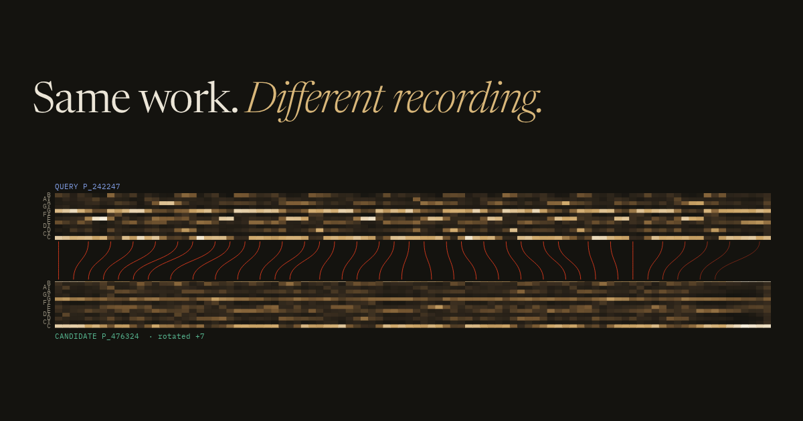
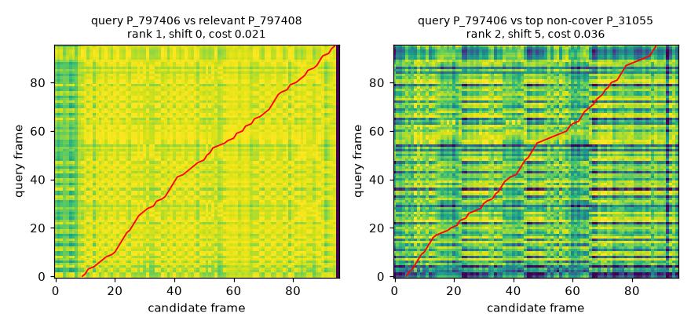

<p align="center">
  
</p>

<h1 align="center">Cover Version Retrieval</h1>

<p align="center">
  <b>Can a machine recognise the same song when almost everything about the recording has changed?</b><br>
  <sub>Structure-aware hybrid retrieval for cover song identification · Da-TACOS · HPCP features only</sub>
</p>

<p align="center">
  <a href="#the-story-in-four-runs">The story</a> ·
  <a href="#how-it-works">How it works</a> ·
  <a href="#what-the-experiments-taught">Findings</a> ·
  <a href="#results">Results</a> ·
  <a href="#run-it">Run it</a> ·
  <a href="web/">Interactive site</a> ·
  <a href="notes/decisions.md">Decision log</a>
</p>

---

A cover changes the key, the tempo, the instruments, the singer, sometimes the structure. What stays is the *composition*, a sequence of harmony. This project tries to find it in two steps:

> **Stage 1 learns to look.** A small convolutional encoder turns a whole recording into one 128-d vector, and exact cosine search keeps the **30** nearest of 15,000 candidates.
>
> **Stage 2 learns to listen closely.** Each of those 30 is key-rotated and **aligned frame by frame** with subsequence DTW, and the alignment decides the final order.

It is built from textbook recurrences, deterministic from a single seed, covered by 119 tests, and evaluated four times on the full Da-TACOS benchmark with every setting locked beforehand.

The first of those evaluations was a **negative result**. This README is mostly about what that result taught.

## The story in four runs

13,000 queries against 15,000 recordings, 12 true covers per query. A random ranking scores about 0.0008 MAP.

| | Run 1 | Run 2 | Run 3 | Run 4 |
|---|:-:|:-:|:-:|:-:|
| **What changed** | the original system | encoder trained on all 4,780 works · hubness correction | + 384-frame reranking | + encoder trained to convergence (150 epochs) |
| Stage-1 MAP | 0.010 | 0.034 | 0.034 | **0.076** |
| Best hybrid MAP | 0.018 | 0.062 | 0.068 | **0.122** |
| Shortlist recall (K = 30) | 0.021 | 0.072 | 0.072 | **0.136** |
| Best system at the time | 0.084 *classical* | 0.136 *classical + hub* | — | — |
| Hybrid behind best by | 4.5× | 2.2× | 2.0× | **1.11×** |

**Run 1 reversed the development results.** On 20 development queries the hybrid had been the best system. On the benchmark, exhaustive classical alignment beat it by 4.5×. That was reported as the headline and not re-tuned away ([D-017](notes/decisions.md)).

**The error analysis found two measurable causes.** Only 2.1% of the true covers ever reached the 30-candidate shortlist. And tonally static recordings acted as *hubs*, matching everything cheaply.

**Every later run attacked one of those causes, with settings chosen only on held-out works.** The gap closed from 4.5× to 1.11×. The hybrid now reranks a query in 38 ms, where exhaustive alignment of the whole benchmark took 2.63 h. Exhaustive corrected alignment is still the most accurate system, and the whole project is still well below published systems (details below).

<sub>Every number is copied from <code>reports/results/benchmark*.json</code>. Ratios use unrounded MAPs.</sub>

## How it works

```mermaid
flowchart LR
    subgraph Data["Da-TACOS · features only · CC BY-NC-SA"]
        H5["HPCP (T × 12)<br/>per recording"]
    end
    H5 --> P1["frame L2 → area-resample → frame L2"]
    P1 -->|"12 × 512"| ENC["TCN encoder<br/>6 dilated residual blocks<br/>mean ‖ max pool → 128-d, L2"]
    P1 -->|"12 × 96 / 384"| CLS["classical view"]
    ENC --> IDX["exact cosine search"]
    IDX -->|"Stage 1: keep top 30"| SL["shortlist"]
    SL --> ROT["best of 12 key rotations"]
    CLS --> ROT
    ROT --> CSM["cosine cross-similarity"] --> DTW["subsequence DTW<br/>steps (1,1) (2,1) (1,2)"]
    DTW --> HUB["− λ · hub reference"] --> BL["α·z(global) + (1−α)·z(alignment)"]
    BL --> OUT["reranked top 30 + untouched remainder"]
```



What that looks like on one real query. The embedding put the true cover **15th**; alignment put it **1st**:

<p align="center">
  
</p>

<p align="center"><sub>Query <code>P_797406</code> against its true cover (left: a clean diagonal groove, path cost 0.021) and against <code>P_31055</code>, a tonally static hub that is a top-10 false positive for 10 of 20 development queries under classical alignment (right: stripes, cost 0.036). From <a href="reports/error_analysis.md">error_analysis.md</a>.</sub></p>

| Stage | Classical or learned | Code |
|---|---|---|
| HPCP loading, validation, normalisation, resampling | classical | `data/datacos.py`, `features/` |
| 12-rotation key invariance (from features, never from key labels) | classical | `alignment/transposition.py` |
| Cross-similarity + subsequence DTW (reference + batched PyTorch) | classical | `alignment/csm.py`, `alignment/dtw.py` |
| TCN encoder (645,504 params), SupCon loss, deterministic CPU training | learned | `models/` |
| Exact index, hybrid reranking, α calibration, hubness correction | glue | `retrieval/` |
| Metrics, work-level bootstrap, error analysis | evaluation | `evaluation/` |

The alignment code is written from the textbook DTW recurrence (Müller, *FMP* §3.2). No cover-song library is imported, and no code comes from the AGPL-licensed `acoss`.

## What the experiments taught

**1 · The shortlist is the ceiling.** If a cover isn't in Stage 1's top 30, nothing downstream can find it. Shortlist recall went from 0.021 to 0.136 across the four runs, and it still caps the hybrid.

**2 · Hubs are real, and one scalar tames them.** Across 120 development candidates, tonal dispersion predicts how often a track is a top-10 false positive (Spearman ρ = −0.77). The worst hub appears in 11 of 20 queries' top 10, where chance gives 1.7. The correction subtracts λ × each candidate's mean score against 200 fixed probe tracks, with λ calibrated on 10 works. On the benchmark it lifted classical alignment from 0.084 to **0.136** and cut the median first-cover rank from 77 to **14** ([D-018](notes/decisions.md)).

**3 · Resolution mattered more than the algorithm.** Averaging a recording down to 96 frames blurs its harmonic rhythm. At 384 frames, development MAP for classical alignment rose from 0.248 to 0.384. That is only affordable inside the 30-item shortlist ([D-019](notes/decisions.md)).

**4 · Data beat architecture.** The same encoder trained on all 4,780 works instead of 1,500 went from 0.181 to 0.319 validation MAP. Training to 150 epochs took it to 0.431, and it was still climbing ([D-020](notes/decisions.md), [D-021](notes/decisions.md)).

**5 · A small test set lied twice.** The 20-query development protocol preferred the hybrid (reversed at scale). Later it said reranking hurts a strong Stage 1 (−0.157), while the benchmark showed it helps (+0.037, interval excluding zero) ([D-022](notes/decisions.md)).

**6 · The idea isn't new; the evidence is.** Hubness correction for cover identification is prior art (Seo 2022; Li & Chen 2018). What this adds is a held-out-calibrated measurement at Da-TACOS scale, on a baseline about 4× weaker than Qmax ([literature check](notes/literature/novelty_assessment.md)).

## Results

### Final benchmark (Da-TACOS, 13,000 × 15,000)

| system | encoder | frames | hub corr. | MAP | MRR | Hit@10 | median first rank |
|---|---|:-:|:-:|:-:|:-:|:-:|:-:|
| Stage 1 · global embedding | 1,500 works, 60 ep | — | — | 0.010 | 0.052 | 0.096 | 185 |
| hybrid, K = 30 | 1,500 works, 60 ep | 96 | — | 0.018 | 0.124 | 0.154 | 185 |
| Stage 1 · global embedding | 4,780 works, 60 ep | — | — | 0.034 | 0.130 | 0.243 | 59 |
| hybrid, K = 30 | 4,780 works, 60 ep | 384 | ✓ | 0.068 | 0.301 | 0.343 | 59 |
| Stage 1 · global embedding | 4,780 works, **150 ep** | — | — | 0.076 | 0.232 | 0.380 | 26 |
| hybrid, K = 30 | 4,780 works, 150 ep | 384 | — | 0.113 | 0.373 | 0.443 | 23 |
| **hybrid, K = 30** | **4,780 works, 150 ep** | **384** | **✓** | **0.122** | **0.402** | **0.462** | **21.5** |
| classical alignment, all pairs | — | 96 | — | 0.084 | 0.282 | 0.352 | 77 |
| **classical alignment, all pairs** | — | **96** | **✓** | **0.136** | **0.397** | **0.481** | **14** |

Each row belongs to one of four separate evaluations, and every setting was fixed beforehand: the encoder from validation works; α, λ and resolution from calibration works. No benchmark result selected anything, and no run was repeated after its result was seen. Work-level bootstrap over 1,000 cliques, ΔAP against the matching Stage 1: hybrid + hub (150 ep) **+0.0457 [+0.0426, +0.0487]**; classical + hub **+0.1013 [+0.0936, +0.1090]**. All intervals exclude zero.

**In context.** On the same benchmark and HPCP input, Qmax scores 0.333 and ByteCover (CQT) 0.714 ([Yesiler et al. 2019](https://archives.ismir.net/ismir2019/paper/000038.pdf); [literature check](notes/literature/novelty_assessment.md)). This project's systems are well below published CSI systems. The findings are about *why* these systems behave as they do.

<details>
<summary><b>Development protocol</b> (20 queries × 120 candidates)</summary>

<br>

One relevant item per query, self excluded, so **AP = reciprocal rank and MAP = MRR**. A random ranking scores about 0.045. Every setting was locked before the run.

| system | MAP (= MRR) | Hit@1 | Hit@10 | mean first rank |
|---|:-:|:-:|:-:|:-:|
| global embedding (Stage 1 only) | 0.189 | 0.10 | 0.35 | 23.5 |
| global embedding + test-time rotations | 0.200 | 0.10 | 0.55 | 20.6 |
| classical alignment over all candidates | 0.248 | 0.15 | 0.45 | 31.3 |
| **hybrid (K = 30, α = 0.05)** | **0.262** | 0.15 | **0.55** | **20.8** |
| rerank only (K = 30, α = 0) | 0.265 | 0.15 | 0.55 | 20.6 |

Paired work-level bootstrap (10,000 resamples), ΔAP [95% CI]: hybrid − global +0.073 [−0.000, +0.178]; rerank-only − global +0.076 [+0.003, +0.181]; hybrid − classical +0.014 [−0.009, +0.042]. Classical ablations (no key handling 0.303, profile-selected rotation 0.248, exhaustive 12-rotation DTW 0.248, profile only 0.266) are mutually indistinguishable at this sample size. This protocol later proved unrepresentative (finding 5): treat it as a plumbing check. Details: [classical_baseline.md](reports/classical_baseline.md), [hybrid_results.md](reports/hybrid_results.md).

</details>

<details>
<summary><b>Runtime</b> (13,000 × 15,000, laptop CPU)</summary>

<br>

| stage | 96 frames | 384 frames |
|---|:-:|:-:|
| embedding 15,000 tracks | 68 s | 68 s |
| exact cosine search | 0.09 s | 0.07 s |
| alignment rerank (13,000 × 30) | 69 s · 5.3 ms/query | 494 s · 38 ms/query |
| hubness probe reference (one-off per catalogue) | 148 s | 2,220 s |
| alignment only (1.95 × 10⁸ pairs) | 9,458 s (2.63 h) | ≈ 42 h (not run) |

</details>

Full write-ups: [improvement_experiments.md](reports/improvement_experiments.md) · [error_analysis.md](reports/error_analysis.md) · [hybrid_results.md](reports/hybrid_results.md) · [dataset_profile.md](reports/dataset_profile.md)

## Run it

```bash
git clone https://github.com/hey-shiv/cover-version-retrieval && cd cover-version-retrieval
python3.12 -m venv .venv && source .venv/bin/activate
pip install -e ".[dev]"        # add ".[faiss]" for the optional FAISS backend
pytest                          # 119 tests, including a synthetic end-to-end pipeline
```

Python 3.11 or newer (developed on 3.12). No data needed for the tests. To run everything on synthetic data, writing to `runs/smoke/` and never to `reports/`:

```bash
PYTHON=python ./scripts/run_smoke.sh
```

<details>
<summary><b>Get the data</b> (Da-TACOS metadata + HPCP, ~17 GB)</summary>

<br>

Da-TACOS has no audio. This project needs the metadata (for work and performance IDs) and the HPCP features. Everything lands in `data/external/`, which is git-ignored. Licensing and leakage rules: [DATASET_CARD.md](DATASET_CARD.md).

```bash
# metadata (3.5 MB)
python scripts/download_datacos.py --what metadata

# fast link: whole HPCP archives (MD5-verified, needs >= 35 GB free while unpacking)
python scripts/download_datacos.py --what coveranalysis_hpcp benchmark_hpcp

# slow link: only the files the manifests need, via HTTP range requests (resumable, CRC-checked)
python scripts/download_datacos.py --fetch-members coveranalysis --config configs/base.yaml
python scripts/download_datacos.py --fetch-members benchmark --config configs/base.yaml
```

</details>

<details>
<summary><b>Reproduce the pipeline</b></summary>

<br>

All commands run from the repository root.

```bash
python scripts/build_manifests.py        --config configs/base.yaml               # deterministic WID-disjoint splits
python scripts/profile_data.py           --config configs/base.yaml --include-benchmark
python scripts/run_classical_baseline.py --config configs/classical_baseline.yaml --resolution-sweep 48 192 384
python scripts/train_encoder.py          --config configs/hybrid_dev.yaml
python scripts/run_hybrid_retrieval.py   --config configs/hybrid_dev.yaml          # calibrates + locks alpha, dev evaluation
python scripts/analyze_hubness.py        --config configs/hybrid_dev.yaml          # analysis only
python scripts/run_benchmark.py          --config configs/benchmark.yaml --with-alignment-only   # FINAL test
```

Improvement experiments ([improvement_experiments.md](reports/improvement_experiments.md)):

```bash
# 1. hubness correction: lambda/method calibrated on calibration works
python scripts/run_hubness_correction.py --config configs/hybrid_dev.yaml
# 2. 384-frame reranking (base default stays 96)
python scripts/run_hybrid_retrieval.py   --config configs/hybrid_dev.yaml --set features.n_frames=384 --tag n384
# 3. encoder on every usable Cover Analysis work
python scripts/build_manifests.py        --config configs/full_train.yaml
python scripts/train_encoder.py          --config configs/full_train.yaml
# combined system, final benchmark
python scripts/run_benchmark.py --config configs/full_train.yaml --tag full384 \
    --set features.n_frames=384 --hub-correction reports/results/hubness_correction_n384.json
```

Notebook: `notebooks/01_feature_and_alignment_inspection.ipynb`, regenerated by `scripts/build_notebook.py`. It imports library functions only.

</details>

<details>
<summary><b>The interactive site</b></summary>

<br>

[`web/`](web/) is a static walk-through of all of the above: real chroma, key rotation you can drag, DTW computed live on the actual matrices, all 20 development queries, and the four benchmark runs. It is built only from committed files in `reports/`, with no audio and no restricted data.

```bash
cd web && npm ci && npm run dev
```

Deploys on Vercel with `web` as the project root. See [web/README.md](web/README.md).

</details>

## Reproducibility

- **One seed**, `20260817`, for split permutation, batch order, augmentation and initialisation. Training runs on CPU with `torch.use_deterministic_algorithms`; a test checks that two runs give bit-identical weights.
- **Frozen protocols.** The committed manifests list every selected work and recording, with its role. Rebuilding them is byte-identical (tested). Candidates are sorted by ID, so score ties break deterministically.
- **Fingerprinted caches**, keyed by the track list and every preprocessing setting.
- **Locked evaluation.** The encoder is chosen on validation works; α, K, λ and resolution on calibration works. All of them are written to disk before any development or benchmark query is scored, and `run_benchmark.py` refuses to run without them.
- **Provenance.** Every result JSON records its git commit and config.

From a fresh clone with the same data, the manifests rebuild byte-identically, the classical rankings match exactly, and retraining reproduces the selected checkpoint **bit for bit** (epoch 50, validation MAP 0.18097).

## Limitations

- **Accuracy is below published CSI systems.** The best system here scores 0.136 MAP; Qmax on the same input scores 0.333.
- **Stage 1 still limits the hybrid.** Shortlist recall is 0.136 at K = 30, and validation MAP was still rising when training stopped.
- **The likely strongest configuration was never run:** classical alignment at 384 frames with hubness correction over all pairs, about 42 h of CPU.
- **Test-time rotation matching was never evaluated on the benchmark.** It was the best development system with the 60-epoch encoder (0.436).
- **Whole-query alignment.** Subsequence DTW aligns the entire query in order, so covers that drop or reorder sections are penalised. Qmax-style local alignment isn't implemented.
- **Thin supervision.** The Cover Analysis subset has two recordings per work.
- **Dataset scope.** Da-TACOS is feature-only, from 2019, and Western-pop-centric. Nothing here establishes robustness to short, live, noisy or partial queries, or to production-scale catalogues.

## What's next

In the order the evidence asks for:

1. **Push Stage-1 recall further:** more epochs, a larger K, multi-vector (per-section) embeddings.
2. **Classical alignment at 384 frames + hubness correction** over the full benchmark (about 42 h).
3. **Test-time rotation matching at benchmark scale** (12× the query-embedding cost).
4. **Local alignment** (Qmax-style) against subsequence DTW, for covers with changed structure.
5. **CREMA / HPCP feature fusion**, and error-stratified evaluation by key shift and length ratio.

## Repository map

```
configs/          base.yaml (+ classical_baseline, hybrid_dev, benchmark, full_train, smoke)
data/manifests/   committed ID-only manifests (splits, protocols, exclusions)
data/external/    Da-TACOS downloads (git-ignored)
src/cover_retrieval/
  data/           datacos.py, manifests.py, splits.py, remote_zip.py, synthetic.py
  features/       hpcp.py, preprocessing.py (validated, fingerprinted feature cache)
  alignment/      transposition.py, csm.py, dtw.py
  models/         tcn_encoder.py, losses.py, training.py
  retrieval/      index.py, rank.py, hybrid.py, normalization.py (hubness correction)
  evaluation/     metrics.py, analysis.py
  utils/          io.py, seed.py
  pipeline.py     shared building blocks used by the scripts
scripts/          download, manifests, profiling, training, evaluation, smoke, notebook
tests/            unit, property and end-to-end tests
reports/          write-ups + results/ (every number) + figures/
notes/            decisions.md (D-001 → D-022), papers/, literature/
web/              the interactive site
```

## References

- Yesiler et al., *Da-TACOS: A Dataset for Cover Song Identification and Understanding*, ISMIR 2019.
- Serrà et al., *Chroma binary similarity and local alignment applied to cover song identification*, IEEE TASLP 2008.
- Müller, *Fundamentals of Music Processing* (2nd ed.), and the FMP notebooks on [music synchronization](https://www.audiolabs-erlangen.de/resources/MIR/FMP/C3/C3_MusicSynchronization.html) and [DTW](https://www.audiolabs-erlangen.de/resources/MIR/FMP/C3/C3S2_DTWbasic.html).
- Khosla et al., *Supervised Contrastive Learning*, NeurIPS 2020. · Bai, Kolter & Koltun, *TCNs for sequence modeling*, 2018.
- Seo, *Pairwise similarity normalization based on a hubness score*, IEICE 2022. · Smucker, Allan & Carterette, CIKM 2007.
- [Essentia cover-song similarity tutorial](https://essentia.upf.edu/tutorial_similarity_cover.html) · Manning et al., [*Introduction to IR*, ch. 8](https://nlp.stanford.edu/IR-book/html/htmledition/evaluation-in-information-retrieval-1.html)

## Licence

Code: MIT (see `LICENSE`). Da-TACOS metadata and features: CC BY-NC-SA 4.0, © Music Technology Group, Universitat Pompeu Fabra. They are not redistributed here, and neither are model weights derived from them.
