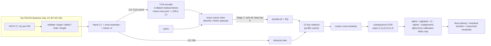

# Structure-Aware Hybrid Retrieval for Cover Song Identification

A reproducible music-information-retrieval system that finds **cover versions** (other recordings of the same composition) on the [Da-TACOS](https://mtg.github.io/da-tacos/) dataset, using only pre-extracted **HPCP** (chroma) features.

It is a two-stage hybrid:

1. **Stage 1 — learned global retrieval.** A compact temporal-convolutional encoder maps a whole track to one 128-d unit vector; exact cosine search ranks every candidate and keeps a shortlist of K = 30.
2. **Stage 2 — structure-aware classical reranking.** For each shortlisted pair, choose the best of 12 key rotations, build a cosine-distance cross-similarity matrix, run slope-constrained **subsequence DTW**, and blend the alignment score with the global score. The blend weight is calibrated only on held-out calibration works.

Everything is deterministic from committed configs and ID-only manifests, tested with `pytest`, and runnable from a fresh clone.

> **Status of results.** The numbers below come from the runs recorded in `reports/results/`. Development-protocol numbers use 20 queries and have wide confidence intervals. Benchmark numbers are labelled as final and come from a single run with every setting locked beforehand. See [Results](#results) and [Limitations](#limitations).

---

## Problem

Cover song identification (CSI) is a **retrieval** problem: given a query recording, rank a collection so that other versions of the same work come first. Covers change key, tempo, structure, instrumentation and vocals, so neither raw spectral similarity nor exact matching works. Relevance is defined only by the SecondHandSongs *work* ID (WID); each recording has a performance ID (PID).

## System



| Component | Classical or learned | Where |
|---|---|---|
| HPCP loading, validation, orientation, normalisation, resampling | classical | `src/cover_retrieval/data/datacos.py`, `features/` |
| 12-rotation key invariance | classical | `alignment/transposition.py` |
| Cross-similarity + DTW / subsequence DTW (reference with backtracking, plus a batched PyTorch version) | classical | `alignment/csm.py`, `alignment/dtw.py` |
| TCN encoder, SupCon / triplet losses, deterministic training | learned | `models/` |
| Exact embedding index, hybrid reranking, alpha calibration | glue | `retrieval/` |
| Metrics, work-level bootstrap, error analysis, plots | evaluation | `evaluation/` |

The alignment code is written from the textbook DTW recurrence (FMP §3.2). No cover-song library is imported, and no code comes from the AGPL-licensed `acoss`.

## Setup

Python 3.11 or newer (developed on 3.12).

```bash
git clone <this repo> && cd cover-version-retrieval
python3.12 -m venv .venv && source .venv/bin/activate
pip install -e ".[dev]"          # add ".[faiss]" for the optional FAISS backend
pytest                            # 111 tests, including the synthetic end-to-end pipeline
```

## Data

Da-TACOS has no audio. This project needs the metadata (for WID/PID identifiers) and the HPCP features, about 17 GB of ZIP archives in total. Everything lands in `data/external/`, which is git-ignored. Licensing and leakage rules are in [DATASET_CARD.md](DATASET_CARD.md).

```bash
# metadata (3.5 MB)
python scripts/download_datacos.py --what metadata

# fast link: whole HPCP archives (MD5-verified, needs >= 35 GB free while unpacking)
python scripts/download_datacos.py --what coveranalysis_hpcp benchmark_hpcp

# slow link: only the files the manifests need, via HTTP range requests (resumable, CRC-checked)
python scripts/download_datacos.py --fetch-members coveranalysis --config configs/base.yaml
python scripts/download_datacos.py --fetch-members benchmark --config configs/base.yaml
```

## Running

All commands run from the repository root.

```bash
python scripts/build_manifests.py        --config configs/base.yaml               # deterministic WID-disjoint splits
python scripts/profile_data.py           --config configs/base.yaml --include-benchmark
python scripts/run_classical_baseline.py --config configs/classical_baseline.yaml --resolution-sweep 48 192 384
python scripts/train_encoder.py          --config configs/hybrid_dev.yaml
python scripts/run_hybrid_retrieval.py   --config configs/hybrid_dev.yaml          # calibrates + locks alpha, dev evaluation
python scripts/run_benchmark.py          --config configs/benchmark.yaml --with-alignment-only   # FINAL test
```

Smoke test on **synthetic** data, which exercises every script. Its outputs go to `runs/smoke/`, never `reports/`:

```bash
PYTHON=python ./scripts/run_smoke.sh
```

Notebook: `notebooks/01_feature_and_alignment_inspection.ipynb`, regenerated by `scripts/build_notebook.py`. It imports library functions only.

## Project layout

```
configs/          base.yaml (+ classical_baseline, hybrid_dev, benchmark, smoke)
data/manifests/   committed ID-only manifests (splits, protocols, exclusions)
data/external/    Da-TACOS downloads (git-ignored)
src/cover_retrieval/
  data/           datacos.py, manifests.py, splits.py, remote_zip.py, synthetic.py
  features/       hpcp.py, preprocessing.py (validated, fingerprinted feature cache)
  alignment/      transposition.py, csm.py, dtw.py
  models/         tcn_encoder.py, losses.py, training.py
  retrieval/      index.py, rank.py, hybrid.py
  evaluation/     metrics.py, analysis.py
  utils/          io.py, seed.py
  pipeline.py     shared building blocks used by the scripts
scripts/          download, manifests, profiling, training, evaluation, smoke, notebook
tests/            unit, property and end-to-end tests
reports/          dataset_profile, classical_baseline, hybrid_results, error_analysis (+ results/, figures/)
notes/            decisions.md (D-001 onward), papers/
```

## Reproducibility controls

* **Fixed seed** `20260817` for split permutation, batch order, augmentation and initialisation (`utils/seed.py`). Training runs on CPU with `torch.use_deterministic_algorithms` and a fixed thread count; a test checks that two runs give bit-identical weights.
* **Frozen protocols.** Committed manifests list every selected WID/PID and role. Rebuilding them is byte-identical (tested). Candidates are sorted by PID, so score ties break deterministically.
* **Fingerprinted caches.** Preprocessed features are keyed by a hash of the track list and every preprocessing setting.
* **Locked evaluation settings.** The encoder checkpoint is chosen on validation works, and alpha/K on calibration works; both are written to `reports/results/hybrid_calibration.json` before any development or benchmark query is scored. `run_benchmark.py` refuses to run without that file and tunes nothing.
* **Provenance.** Every result JSON records the git commit and config path.

## Results

<!-- RESULTS-START -->
_Populated from `reports/results/*.json` after the runs complete._
<!-- RESULTS-END -->

## Limitations

* **Pilot resolution.** The classical stage averages each track down to 96 frames (D-005), which blurs harmonic rhythm. The resolution sweep in `reports/classical_baseline.md` shows how much this costs.
* **Small development protocol.** 20 queries against 120 candidates; bootstrap intervals are wide, and dev-set differences whose interval spans zero are not claimed as improvements.
* **Training data budget.** The encoder was trained on 1,500 of the roughly 4,800 usable Cover Analysis works, because of a 0.3–0.45 MB/s link (D-010). With two recordings per work, supervision is thin.
* **Asymmetric, whole-query alignment.** Subsequence DTW aligns the entire query; a cover that drops or reorders sections is penalised. Serrà-style local alignment (Qmax) is not implemented.
* **Dataset scope.** Da-TACOS is feature-only, from 2019, and Western-pop-centric. Nothing here establishes robustness to short or partial queries, live or user-generated recordings, or production-scale catalogues.

## Next research directions

1. Local alignment (Qmax-style) versus subsequence DTW as the reranker, at matched resolution.
2. Beat-synchronous or higher-resolution classical features, and whether the gain survives at benchmark scale.
3. Training the encoder on all Cover Analysis works, plus CREMA/HPCP feature fusion.
4. Error-stratified evaluation (e.g. by rotation shift or length ratio) to test *where* the reranker helps.

## References

* Yesiler et al., *Da-TACOS*, ISMIR 2019. · Serrà et al., *Chroma binary similarity and local alignment applied to cover song identification*, IEEE TASLP 2008.
* Müller, *Fundamentals of Music Processing* (2nd ed.) and FMP notebooks: [music synchronization](https://www.audiolabs-erlangen.de/resources/MIR/FMP/C3/C3_MusicSynchronization.html), [DTW](https://www.audiolabs-erlangen.de/resources/MIR/FMP/C3/C3S2_DTWbasic.html).
* [Essentia cover-song similarity tutorial](https://essentia.upf.edu/tutorial_similarity_cover.html). · Manning et al., [*Introduction to IR*, ch. 8](https://nlp.stanford.edu/IR-book/html/htmledition/evaluation-in-information-retrieval-1.html).
* Khosla et al., *Supervised Contrastive Learning*, NeurIPS 2020. · Bai, Kolter & Koltun, *TCNs for sequence modeling*, 2018. · Smucker, Allan & Carterette, CIKM 2007.

## Licence

Code: MIT (see `LICENSE`). Da-TACOS metadata and features: CC BY-NC-SA 4.0, © Music Technology Group, UPF. They are not redistributed here.
