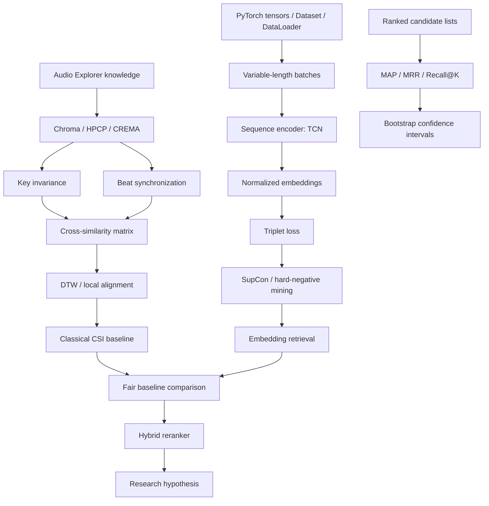

# Research & Learning Dossier
## Structure-Aware Hybrid Retrieval for Cover Song Identification

Your Audio Explorer covered the signal-processing entry point. This dossier moves you into the next layer:

> Represent music as sequences → compare versions robustly → learn retrieval embeddings → evaluate claims like a researcher.

The right learning order is not "finish DSP, then ML." It is:

```text
dataset protocol → chroma/alignment baseline → evaluation
→ metric-learning encoder → retrieval index → hybrid reranking
→ controlled experiments → research question
```

Da-TACOS is a particularly good fit because it provides precomputed MIR features, so you can focus on retrieval and learning instead of downloading hundreds of gigabytes of raw audio. Its benchmark contains 13,000 cover tracks in 1,000 cliques plus 2,000 distractors; its separate cover-analysis set contains 5,000 cover pairs. [Da-TACOS paper](https://archives.ismir.net/ismir2019/paper/000038.pdf)

---

## 1. Exact resource curriculum

### Tier 1 — Must study

| Resource | Format | Study exactly | Why it matters here | Prerequisite / time / depth |
|---|---|---|---|---|
| [Fundamentals of Music Processing, 2nd ed. — Meinard Müller, 2021](https://link.springer.com/book/10.1007/978-3-030-69808-9) | Book | Ch. 3, §§3.1–3.2: audio features and DTW | Gives you the mathematical language for chroma features, synchronization, and alignment | Audio Explorer level; 6–8h; selective |
| [FMP Notebooks v1.2.6 — Müller & Zalkow](https://www.audiolabs-erlangen.de/resources/MIR/FMP/C3/C3.html) | Executable tutorials | Ch. 3: chroma, transposition, DTW, subsequence DTW, audio matching | Your best learn-by-coding source for the classical baseline | Python/NumPy; 8h; selective but execute |
| ["Chroma Binary Similarity and Local Alignment Applied to Cover Song Identification" — Serrà, Gómez, Herrera, Serra, 2008](https://ieeexplore.ieee.org/document/4523006) | Paper | Abstract, §§1–4, figures, conclusion | The classical CSI problem formulation and local-alignment logic | Basic chroma; 3–4h; selective |
| ["Da-TACOS: A Dataset for Cover Song Identification and Understanding" — Yesiler et al., 2019](https://archives.ismir.net/ismir2019/paper/000038.pdf) | Paper + dataset | §§3 and 5; Table 1; metrics table | Defines your dataset, features, cliques, and benchmark discipline | None; 3h; read fully |
| [Da-TACOS dataset repository — Music Technology Group](https://github.com/MTG/da-tacos) | Dataset/docs | README: Structure, features, download, license | Authoritative source for loading H5 features and legal use | None; 2h; read fully |
| [Cover Song Identification tutorial — Essentia / MTG](https://essentia.upf.edu/tutorial_similarity_cover.html) | Tutorial | Entire tutorial, especially HPCP → cross-similarity → local alignment | Implements the exact classical chain you need to understand before ML | Chroma intuition; 2h; execute selectively |
| [Dynamic Time Warping — FMP Notebook](https://www.audiolabs-erlangen.de/resources/MIR/FMP/C3/C3S2_DTWbasic.html) | Tutorial | Entire notebook; then DTW variants/subsequence DTW | Teaches the dynamic program you should implement once yourself | Basic matrices; 3h; execute |
| [PyTorch Data Loading docs](https://docs.pytorch.org/docs/stable/data.html) and [Reproducibility notes](https://docs.pytorch.org/docs/stable/notes/randomness) | Official docs | `Dataset`, `DataLoader`, `collate_fn`, worker seeds | Directly needed for variable-length feature sequences and credible results | Python/PyTorch basics; 2h; selective |
| [TripletMarginLoss — PyTorch](https://docs.pytorch.org/docs/stable/generated/torch.nn.modules.loss.TripletMarginLoss.html) | Official docs | Formula, arguments, example | Your first learned retrieval objective | Embeddings and cosine/L2 distance; 45 min; read fully |

### Tier 2 — Should study

| Resource | Format | Study exactly | Why it matters | Time / depth |
|---|---|---|---|---|
| ["A Prototypical Triplet Loss for Cover Detection" — Doras & Peeters, 2020](https://arxiv.org/abs/1910.09862) | Paper | §§1, 3–5 | Makes the case that CSI is retrieval, not huge multiclass classification | 3h; read fully |
| ["Combining Musical Features for Cover Detection" — Doras et al., 2020](https://archives.ismir.net/ismir2020/paper/000239.pdf) | Paper | §§2–5, especially feature-fusion experiments | Direct motivation for your later global-plus-local hybrid | 3h; read fully |
| ["Supervised Contrastive Learning" — Khosla et al., 2020](https://papers.nips.cc/paper_files/paper/2020/file/d89a66c7c80a29b1bdbab0f2a1a94af8-Paper.pdf) | Paper | §§2–3, loss equation, experiments | Your second loss after a triplet baseline | 2–3h; selective |
| [PyTorch Metric Learning docs — Musgrave](https://kevinmusgrave.github.io/pytorch-metric-learning/) | Docs/library | Triplet loss, `BatchHardMiner`, testers | Reference implementation of losses/mining; use after you write one simple version yourself | 2h; selective |
| ["An Empirical Evaluation of Generic Convolutional and Recurrent Networks for Sequence Modeling" — Bai, Kolter, Koltun, 2018](https://arxiv.org/abs/1803.01271) | Paper | §§2–4 | Justifies a TCN as your first sequence encoder instead of jumping to Transformers | 2h; selective |
| [FAISS Getting Started — Meta](https://github.com/facebookresearch/faiss/wiki/getting-started) | Docs | `IndexFlatIP`, adding vectors, search | Lets your embedding system retrieve candidates efficiently | 1h; execute |
| [MIREX Cover Song Identification task](https://music-ir.org/mirex/wiki/2025%3ACover_Song_Identification) | Benchmark protocol | Data/evaluation/runtime sections | Teaches what a proper CSI evaluation expects | 1h; read |
| ["A Comparison of Statistical Significance Tests for Information Retrieval Evaluation" — Smucker, Allan, Carterette, 2007](https://maroo.cs.umass.edu/pdf/IR-591.pdf) | Paper | §§1–3 and conclusion | Prevents you from mistaking noise for progress | 2h; selective |

### Tier 3 — Reference only for now

Do not read these before your classical and triplet baselines exist.

| Resource | Why it is later |
|---|---|
| ["Soft-DTW: a Differentiable Loss Function for Time-Series" — Cuturi & Blondel, 2017](https://arxiv.org/abs/1703.01541) | Useful only after hard DTW/local alignment works |
| ["Training Audio Transformers for Cover Song Identification" — Te Zeng & Francis C. M. Lau, 2023](https://link.springer.com/article/10.1186/s13636-023-00297-4) | Architecture comparison, not your initial model |
| ["DisCover: Disentangled Music Representation Learning for Cover Song Identification" — Xun et al., 2023](https://arxiv.org/abs/2307.09775) | Research-extension reference after error analysis |
| ["X-Cover" — Du et al., 2024](https://doi.org/10.5281/zenodo.14877280) | Possible lyrics/ASR extension; not your first system |
| [MARBLE: Music Audio Representation Benchmark — Yuan et al., 2023](https://arxiv.org/abs/2306.10548) | Broader music-representation context |
| [MERT — Li et al., 2024](https://arxiv.org/abs/2306.00107) | Foundation model context; do not try to reproduce 95M–330M pretraining |

---

## 2. Resource stack by topic

One source to understand each topic; one source to implement it.

| Topic | Understand | Implement |
|---|---|---|
| MIR | [FMP Ch. 3](https://www.audiolabs-erlangen.de/resources/MIR/FMP/C3/C3.html) | [FMP music synchronization notebook](https://www.audiolabs-erlangen.de/resources/MIR/FMP/C3/C3_MusicSynchronization.html) |
| Cover-song identification | [Serrà et al. 2008](https://ieeexplore.ieee.org/document/4523006) | [Essentia CSI tutorial](https://essentia.upf.edu/tutorial_similarity_cover.html) |
| Chroma / HPCP / CQT | [FMP music synchronization](https://www.audiolabs-erlangen.de/resources/MIR/FMP/C3/C3_MusicSynchronization.html) | [`librosa.feature.chroma_cqt`](https://librosa.org/doc/latest/generated/librosa.feature.chroma_cqt.html) and [Essentia HPCP](https://essentia.upf.edu/reference/std_HPCP.html) |
| Beat synchronization | [FMP beat-tracking notebook](https://www.audiolabs-erlangen.de/resources/MIR/FMP/C6/C6S3_BeatTracking.html) | [`librosa.beat.beat_track`](https://librosa.org/doc/latest/generated/librosa.beat.beat_track.html) |
| DTW | [FMP DTW notebook](https://www.audiolabs-erlangen.de/resources/MIR/FMP/C3/C3S2_DTWbasic.html) | [`librosa.sequence.dtw`](https://librosa.org/doc/latest/generated/librosa.sequence.dtw.html) |
| Local sequence alignment | [Essentia CSI tutorial](https://essentia.upf.edu/tutorial_similarity_cover.html) | [`acoss` Serra09 implementation](https://github.com/furkanyesiler/acoss) |
| Music embeddings | [Doras & Peeters 2020](https://arxiv.org/abs/1910.09862) | [PyTorch Metric Learning](https://kevinmusgrave.github.io/pytorch-metric-learning/) |
| Metric learning | [Doras & Peeters 2020](https://arxiv.org/abs/1910.09862) | [PyTorch `TripletMarginLoss`](https://docs.pytorch.org/docs/stable/generated/torch.nn.modules.loss.TripletMarginLoss.html) |
| Triplet loss | [Triplet-loss formulation](https://docs.pytorch.org/docs/stable/generated/torch.nn.modules.loss.TripletMarginLoss.html) | Write it with `torch.cdist`; then compare with PyTorch's loss |
| Supervised contrastive learning | [Khosla et al. 2020](https://arxiv.org/abs/2004.11362) | [PyTorch Metric Learning losses](https://kevinmusgrave.github.io/pytorch-metric-learning/losses/) |
| Hard-negative mining | ["In Defense of the Triplet Loss"](https://arxiv.org/abs/1703.07737) | [`BatchHardMiner`](https://kevinmusgrave.github.io/pytorch-metric-learning/miners/) |
| TCN / sequence encoder | [Bai et al. 2018](https://arxiv.org/abs/1803.01271) | [LocusLab TCN](https://github.com/locuslab/TCN) |
| FAISS / ANN search | [FAISS index-choice guide](https://github.com/facebookresearch/faiss/wiki/Guidelines-to-choose-an-index) | [FAISS Getting Started](https://github.com/facebookresearch/faiss/wiki/getting-started) |
| IR evaluation | [MIREX CSI protocol](https://music-ir.org/mirex/wiki/2025%3ACover_Song_Identification) | Your own `metrics.py` with unit tests |
| MAP / MRR / Recall@K | [Stanford IR book, Ch. 8](https://nlp.stanford.edu/IR-book/html/htmledition/evaluation-in-information-retrieval-1.html) | Implement from ranked IDs; validate on hand-calculated examples |
| Ranking evaluation | [Da-TACOS §5](https://archives.ismir.net/ismir2019/paper/000038.pdf) | [`acoss.coverid` benchmark interface](https://github.com/furkanyesiler/acoss) |
| Ablations | [ML Reproducibility Checklist — Pineau et al.](https://www.cs.mcgill.ca/~jpineau/ReproducibilityChecklist.pdf) | YAML config per run plus a single results CSV |
| Bootstrap confidence intervals | [Smucker et al. 2007](https://maroo.cs.umass.edu/pdf/IR-591.pdf) | [`scipy.stats.bootstrap`](https://docs.scipy.org/doc/scipy/reference/generated/scipy.stats.bootstrap.html) |
| Reproducible ML | [PyTorch reproducibility notes](https://docs.pytorch.org/docs/stable/notes/randomness) | Fixed seeds, versioned configs, environment lockfile, checkpoints |

---

## 3. Core paper reading path

Read in this order. Do not jump to papers 8–11 early.

### 1. Serrà, Gómez, Herrera, Serra — 2008
[Chroma Binary Similarity and Local Alignment Applied to Cover Song Identification](https://ieeexplore.ieee.org/document/4523006)
- **Problem:** find alternate recordings of the same composition despite changes in key, tempo, and arrangement.
- **Contribution:** tonal representation plus local alignment for CSI.
- **Method:** chroma features, transposition handling, cross-similarity matrix, local alignment.
- **Data/evaluation:** cover-song retrieval metrics and ranking.
- **You must understand:** why chroma intentionally ignores octave/timbre detail; why a path through a similarity matrix can match different tempos.
- **Prerequisite:** your Audio Explorer.
- **Reproduce:** yes—the first baseline.

### 2. Yesiler et al. — 2019
[Da-TACOS: A Dataset for Cover Song Identification and Understanding](https://archives.ismir.net/ismir2019/paper/000038.pdf)
- **Problem:** CSI comparisons were hard because data and algorithms were fragmented.
- **Contribution:** open feature-based data and benchmarking framework.
- **Method:** dataset construction, feature extraction, seven baseline systems.
- **Data/evaluation:** 15k benchmark tracks; MAP, MRR, mean/median rank, Top-1/Top-10.
- **You must understand:** WID versus PID, cover cliques, distractors, and no-leakage evaluation.
- **Prerequisite:** Paper 1.
- **Reproduce:** use its protocol, not its results blindly.

### 3. Doras & Peeters — 2020
[A Prototypical Triplet Loss for Cover Detection](https://arxiv.org/abs/1910.09862)
- **Problem:** global multiclass classification does not match open-world cover retrieval.
- **Contribution:** metric-learning view and prototypical triplet loss.
- **Method:** sequence input → embedding → cover pairs near, noncovers far.
- **Data/evaluation:** realistic low-covers-per-work retrieval.
- **You must understand:** anchor, positive, negative, margin, class/prototype.
- **Prerequisite:** Papers 1–2.
- **Reproduce:** ordinary triplet loss only; do not begin with the prototype variant.

### 4. Khosla et al. — 2020
[Supervised Contrastive Learning](https://arxiv.org/abs/2004.11362)
- **Problem:** triplets waste information when batches contain many positives and negatives.
- **Contribution:** a batch loss that pulls all same-label embeddings together.
- **Method:** normalized embeddings, temperature-scaled contrastive objective.
- **Data/evaluation:** image classification; transfer the loss idea, not the domain assumptions.
- **You must understand:** how labels define all positives in a batch.
- **Prerequisite:** Paper 3.
- **Reproduce:** later, as a fair loss-function ablation.

### 5. Bai, Kolter, Koltun — 2018
[An Empirical Evaluation of Generic Convolutional and Recurrent Networks for Sequence Modeling](https://arxiv.org/abs/1803.01271)
- **Problem:** when should a temporal convolution replace recurrence?
- **Contribution:** evidence that simple dilated causal/convolutional encoders are strong sequence baselines.
- **Method:** residual temporal convolution blocks.
- **You must understand:** receptive field, dilation, temporal pooling.
- **Prerequisite:** PyTorch modules and padded sequences.
- **Reproduce:** a tiny non-causal TCN encoder for feature sequences, not the paper's whole benchmark.

### 6. Doras et al. — 2020
[Combining Musical Features for Cover Detection](https://archives.ismir.net/ismir2020/paper/000239.pdf)
- **Problem:** melody, harmony, timbre, and rhythm carry different cover evidence.
- **Contribution:** shows feature combinations outperform single views.
- **Method:** feature-specific systems and fusion.
- **Data/evaluation:** large CSI sets, retrieval metrics.
- **You must understand:** why a good system can be hybrid rather than a giant monolithic model.
- **Prerequisite:** Papers 1–5.
- **Reproduce:** single-feature versus simple average fusion; this becomes an ablation.

### 7. Cuturi & Blondel — 2017
[Soft-DTW: a Differentiable Loss Function for Time-Series](https://arxiv.org/abs/1703.01541)
- **Problem:** ordinary DTW is not differentiable.
- **Contribution:** differentiable soft minimum over alignment paths.
- **Method:** temperature-smoothed dynamic program.
- **You must understand:** hard minimum versus soft minimum.
- **Prerequisite:** ordinary DTW, not deep learning.
- **Reproduce:** no. Use `tslearn` first; only explore it after the hard-alignment system exists.

### 8. Zeng & Lau — 2023
[Training Audio Transformers for Cover Song Identification](https://link.springer.com/article/10.1186/s13636-023-00297-4)
- **Problem:** can global long-range context improve CSI?
- **Contribution:** Audio Similarity Transformer and ranking-aware loss.
- **Method:** CREMA sequence patches, Siamese transformer, MAP-oriented training.
- **You must understand:** why it is an architectural alternative to your TCN.
- **Prerequisite:** Papers 3–6.
- **Reproduce:** no. Read only after your TCN is evaluated.

### 9. Xun et al. — 2023
[DisCover: Disentangled Music Representation Learning for Cover Song Identification](https://arxiv.org/abs/2307.09775)
- **Problem:** learned representations entangle version-specific and work-specific properties.
- **Contribution:** explicit disentanglement approach.
- **Method:** knowledge-guided and adversarial components.
- **You must understand:** the research gap, not every loss term.
- **Prerequisite:** Papers 3–6.
- **Reproduce:** no. It is a research extension source.

### 10. Du et al. — 2024
[X-Cover: Better Music Version Identification System by Integrating Pretrained ASR Model](https://doi.org/10.5281/zenodo.14877280)
- **Problem:** audio-only similarity can lose linguistic clues for vocal songs.
- **Contribution:** combines pretrained speech representations with CSI.
- **You must understand:** modality-specific failure modes.
- **Prerequisite:** a completed audio-only system and error taxonomy.
- **Reproduce:** no.

### 11. Smucker, Allan, Carterette — 2007
[A Comparison of Statistical Significance Tests for IR Evaluation](https://maroo.cs.umass.edu/pdf/IR-591.pdf)
- **Problem:** whether metric differences between retrieval systems are real.
- **Contribution:** compares paired tests, bootstrap, and randomization approaches.
- **You must understand:** the unit of resampling is the query/work—not individual ranked items.
- **Prerequisite:** MAP/MRR implementation.
- **Reproduce:** bootstrap confidence intervals for per-work AP differences.

### 12. Yuan et al. — 2023
[MARBLE: Music Audio Representation Benchmark for Universal Evaluation](https://arxiv.org/abs/2306.10548)
- **Problem:** general music representations need unified evaluation.
- **Contribution:** multi-task benchmark and evaluation protocol.
- **You must understand:** representation claims must be backed by tasks and protocols.
- **Prerequisite:** your baseline report.
- **Reproduce:** no.

---

## 4. Read → understand → implement → measure

| After reading | Implement | Measure | Compare against |
|---|---|---|---|
| Serrà 2008 | 12-shift chroma/HPCP similarity and local alignment | rank of true cover versus random negatives | no-shift cosine similarity |
| Da-TACOS 2019 | loader, WID/PID parsing, evaluation protocol | eligible queries, distractors, feature shapes | hand-checked metadata |
| Doras & Peeters | global sequence embedding with triplet loss | validation MAP/MRR/Recall@K | classical alignment baseline |
| Khosla et al. | SupCon objective | same encoder, same batch design, same split | triplet loss |
| Bai et al. | small TCN encoder | parameter count, runtime, validation retrieval | mean-pooled feature baseline |
| Doras et al. | feature/fusion ablation | single-view versus fused retrieval | strongest single feature |
| Soft-DTW | rerank top-K only | MAP and reranking latency | hard local alignment |
| Zeng & Lau | architecture note, not code | N/A initially | your TCN is the justified baseline |
| DisCover | failure taxonomy by tempo/key/arrangement | subgroup metrics | global-only versus hybrid |
| Smucker et al. | work-level bootstrap CI for ΔMAP | 95% interval for each improvement | "difference is real" only if interval excludes zero |

---

## 5. Prerequisite tree



| Status | Concepts |
|---|---|
| **Already know** | Python, NumPy, visualization, waveform/STFT/mel/MFCC intuition, basic beat tracking, neural-network fundamentals |
| **Must learn before implementation** | WID/PID/clique protocol, chroma/HPCP intuition, 12-key rotation, ranking metrics, DTW dynamic program, self-exclusion in retrieval |
| **Learn while implementing** | H5 dataset loading, padded batches, masks, TCN, triplet loss, batch construction, FAISS, logging/configs |
| **Safely postpone** | Soft-DTW, SupCon, hard-negative miners, Transformer encoders, pretrained music models, ASR/lyrics fusion, approximate FAISS indexes beyond exact search |

---

## 6. Minimum knowledge rule

| Concept | Minimum depth now | You may move on when… |
|---|---|---|
| Chroma | Intuition + know a frame has 12 pitch classes; code a circular shift | You can explain why a C-major and D-major version need rotation |
| HPCP | Know it is a harmonically weighted chroma representation; library-level use | You can inspect its shape, visualize it, and normalize it |
| CQT | Intuition only: log-spaced frequency bins align with musical pitch | You can explain why it supports chroma; do not derive kernels |
| Beat synchronization | Know beats can normalize tempo variation; use supplied onsets initially | You can state when beat tracking may fail |
| DTW | Intuition, recurrence, backtracking, one handwritten toy example | You can implement basic DTW from scratch and recover a path |
| Local alignment | Know why global start-to-end matching fails on reordered/partial sections | You can explain the difference from ordinary DTW |
| Triplet loss | Full formula, margin intuition, batch construction | You can code it without a library and diagnose zero loss |
| SupCon | Intuition and loss inputs; postpone implementation until triplet baseline | You can describe its difference from triplet loss |
| Batch-hard mining | Concept only at first | You can identify hardest positive/negative from a batch distance matrix |
| TCN | Receptive field, dilation, pooling; no proof required | You can build a 2–4 block encoder and compute output shape |
| FAISS | `IndexFlatIP`, normalized vectors, `add`, `search` | You can verify nearest self-neighbour on a toy set |
| Soft-DTW | Postpone; only know that it is differentiable DTW | Start only after a hard-alignment reranker is measured |
| MAP | Full hand calculation for one query | Your unit test returns the right AP for a known ranking |
| MRR | Full hand calculation | You can state why it cares only about the first relevant result |
| Recall@K | Full hand calculation | You can explain why it is not enough alone |
| Bootstrap CI | Procedure-level understanding | You resample **cliques/works**, not individual tracks, and report a 95% interval |

Do not spend days mastering a proof unless your implementation exposes a gap. Your standard is operational understanding plus the ability to explain each design choice.

---

## 7. Repositories to study

| Repository | What to read | Do not copy | Safety / mapping |
|---|---|---|---|
| [MTG/da-tacos](https://github.com/MTG/da-tacos) | README, H5 structure, download script, license | Dataset files or metadata dumps | Safe reference. Code is Apache-2.0; dataset features are separately CC BY-NC-SA 4.0 |
| [`acoss`](https://github.com/furkanyesiler/acoss) | `algorithms`, `coverid`, benchmark interface, `Serra09` | Do not copy implementation into your own permissively licensed repo; it is AGPL-3.0 | Read and compare output; use it as an external reference baseline |
| [Deep Learning 101 for Audio MIR](https://github.com/geoffroypeeters/deeplearning-101-audiomir_notebook) | CSI notebooks for Cover1000/Da-TACOS | Large notebook structure or unexamined code | Good educational reference; reimplement concepts in your project layout |
| [FMP / libfmp](https://github.com/meinardmueller/libfmp) | Ch. 3 notebooks, DTW, subsequence matching | Whole notebook as production code | Best source for understanding and toy implementations |
| [Essentia](https://github.com/MTG/essentia) | HPCP and `CoverSongSimilarity` documentation/examples | Large dependency-specific pipelines | Use as a correctness oracle for the first baseline |
| [PyTorch Metric Learning](https://github.com/KevinMusgrave/pytorch-metric-learning) | Loss/miner APIs and tests | Its training framework before you understand batching | Use only after your custom triplet-loss prototype works |
| [FAISS](https://github.com/facebookresearch/faiss) | Python tutorial and index docs | IVF/PQ/GPU complexity initially | Start with exact `IndexFlatIP`; FAISS is MIT-licensed |
| [`tslearn`](https://github.com/tslearn-team/tslearn) | `soft_dtw` API and examples | Soft-DTW internals initially | Use later for a controlled reranking experiment |
| [`mir_eval`](https://github.com/mir-evaluation/mir_eval) | Testing style and metric transparency | Assuming it contains CSI ranking metrics—it does not solve your MAP protocol | Good reference for MIR evaluation habits; it is MIT-licensed |

---

## 8. Da-TACOS deep dive

### Structure
Da-TACOS contains no audio. It contains metadata and precomputed features derived from MP3 recordings.

- **Cover-analysis subset:** 10,000 tracks, 5,000 two-track cover cliques.
- **Benchmark subset:** 15,000 tracks:
  - 13,000 tracks in 1,000 cliques of 13 versions each
  - 2,000 singleton distractors/noise tracks
  [Dataset paper, §3](https://archives.ismir.net/ismir2019/paper/000038.pdf)

A **WID** is a work/clique identifier. A **PID** is one recording/performance identifier. Same WID means relevant cover; same PID is the exact same item and must be excluded from its own ranking.

### Files and features
- Metadata: JSON dictionary keyed by WID, then PID.
- Feature files: `.h5`, loaded through `deepdish`.
- Single-file H5 option: all features for one recording.
- Per-feature option: download only CENS, CREMA, HPCP, etc.

Important feature fields:
- `hpcp`: harmonic pitch-class profile
- `chroma_cens`: energy-normalized chroma
- `crema`: chord-informed pitch-class representation
- `mfcc_htk`: timbral baseline feature
- `key_extractor`: estimated key, scale, confidence
- `madmom_features`: onset functions, beat locations, tempo
- `tags`: metadata tags
- `label`: WID
- `track_id`: PID

### Correct train/validation/test policy
Use this policy:
1. **Cover-analysis subset:** split by WID into train and validation, e.g. 80/20. No WID may appear in both.
2. **Benchmark subset:** untouched final test set. Do not tune thresholds, model choices, or fusion weights on it.
3. **Development smoke tests:** a tiny fixed WID sample from the cover-analysis training split.
4. **Final report:** run once on Da-TACOS benchmark after choosing every setting from validation.

The cover-analysis subset is suitable for initial supervised pairs but has only two versions per work. That is enough for your first triplet system, but it is not ideal large-scale supervision. Do not pretend it is.

### Exact evaluation protocol
For each eligible benchmark query:
1. Compare it against all 15,000 candidate tracks.
2. Exclude the query itself.
3. Mark tracks with the same WID as relevant.
4. Keep the 2,000 singleton tracks as negatives/distractors.
5. Compute per-query AP, reciprocal rank, rank of first relevant item, and Recall@K.
6. Aggregate across the 13,000 clique-member queries.

Report:
- MAP
- MRR
- mean and median rank of first relevant cover
- Recall@1 / @10 / @100
- runtime: feature loading, embedding extraction, candidate retrieval, reranking separately

### Licensing and GitHub discipline
The repository code is Apache-2.0. The metadata and features are **CC BY-NC-SA 4.0**. [License statement](https://github.com/MTG/da-tacos)

Commit:
- loaders
- configs
- download instructions
- checksums/manifests
- aggregate metrics
- plots generated from results
- tiny synthetic fixtures for tests
- attribution and data-license notice

Do not commit:
- H5 features
- metadata dumps
- audio
- redistributable dataset archives
- pretrained weights trained on this data unless you first obtain explicit clarification that distribution is permitted

### Useful later datasets

| Dataset | Use later? | Why |
|---|---|---|
| [Covers80](https://labrosa.ee.columbia.edu/projects/coversongs/covers80/) | Yes, now only for audio sanity checks | 160 recordings / 80 pairs; tiny but good for visual demonstrations |
| [Covers1000](http://www.covers1000.net/) | Later | More cliques; useful external check |
| [SHS100K](https://huggingface.co/datasets/Yougen/shs100k_dataset) | Later, not now | Raw audio collection is about 306 GB and has access conditions |
| [CoversBR](https://github.com/joaopaulomichereff/coversBR) | Later | Large Brazilian collection; valuable for robustness beyond Western pop |

---

## 9. One reproduction target

Reproduce the **Serrà-style chroma/HPCP cross-similarity plus local alignment system**, using Da-TACOS features and `acoss`/Essentia only as external references.

Do not reproduce a Transformer first.

### Exact components
1. Load precomputed HPCP or CENS sequences.
2. Normalize feature vectors.
3. Try 12 circular pitch-class rotations to handle key changes.
4. Form a cross-similarity/cost matrix.
5. Use local alignment or subsequence DTW to produce a pairwise distance.
6. Rank all candidates and compute MAP/MRR/Recall@K.

### What may be simplified
- Use precomputed features; do not extract audio features yourself.
- Start with a 100-clique development slice.
- Start with one feature: HPCP.
- Use simple cosine or Euclidean local cost.
- Do not implement similarity-network fusion, melody extraction, source separation, or learned fusion.

### Credible reproduction standard
It is credible when:
- all metrics have unit tests from hand-calculated rankings;
- three chosen cover pairs score better than obvious noncovers under the same procedure;
- your rankings are deterministic for fixed data/config;
- your full-system result is in the same broad performance regime as the referenced implementation under matched inputs and protocol;
- you show failure cases rather than only successes.

Expected failure cases:
- heavily rearranged versions;
- instrumental versus vocal versions;
- inaccurate key/beat estimates;
- songs sharing common chord progressions;
- partial or short queries.

---

## 10. Experiment-design training

| Experiment type | For this project |
|---|---|
| **Baseline** | HPCP + 12-shift local alignment |
| **Strong baseline** | CREMA + alignment, or HPCP/CENS score fusion |
| **Proposed model** | TCN global embedding + FAISS shortlist + local alignment rerank |
| **Ablation** | Remove reranker; remove transposition search; switch feature view; switch triplet to SupCon; alter shortlist size |
| **Robustness test** | Query crops: 5/10/20/30 seconds; synthetic pitch shifts; tempo perturbations; metadata-based instrumental/vocal slices |
| **Error analysis** | Top false positives and false negatives by WID, key offset, tempo ratio, candidate rank |
| **Statistical confidence** | Bootstrap works/cliques 1,000–10,000 times; report 95% CI for ΔMAP and ΔMRR |
| **Fair comparison** | Same candidate set, same query set, same data split, same feature durations, same validation-derived hyperparameters |

Rules:
- Change one variable at a time.
- Do not pick the best of 20 test-set trials.
- Use validation to choose hyperparameters; lock them before final benchmark.
- A 0.003 MAP gain with a confidence interval crossing zero is not evidence.
- If the hybrid system is slower, report the retrieval-quality/latency tradeoff honestly.

For bootstrap: resample **WIDs/cliques**, recompute mean AP difference, and form a percentile 95% CI. Do not resample individual tracks as if all 13 versions of a work were independent.

---

## 11. PyTorch: only what you need

| Feature | Resource | Tiny exercise | Project use |
|---|---|---|---|
| `Dataset` / `DataLoader` | [PyTorch data docs](https://docs.pytorch.org/docs/stable/data.html) | Return `{features, wid, pid, length}` from five H5 files | Da-TACOS feature loading |
| Variable-length batches | [`pad_sequence`](https://docs.pytorch.org/docs/stable/generated/torch.nn.utils.rnn.pad_sequence.html) | Pad three sequences and return lengths/mask | TCN batching |
| Masks | [PyTorch tensor basics](https://pytorch.org/tutorials/beginner/basics/tensorqs_tutorial.html) | Implement masked mean pooling; verify padded values do not change output | Convert frame embeddings to one track embedding |
| `nn.Module` | [Build the Neural Network](https://pytorch.org/tutorials/beginner/basics/buildmodel_tutorial.html) | Write `TCNEncoder(12 → 128)` and verify output `(B, D)` | Your learned retriever |
| Custom triplet loss | [TripletMarginLoss docs](https://docs.pytorch.org/docs/stable/generated/torch.nn.modules.loss.TripletMarginLoss.html) | Compare manual formula to PyTorch output | First metric-learning experiment |
| Grouped batches / mining | [BatchHardMiner docs](https://kevinmusgrave.github.io/pytorch-metric-learning/miners/) | Construct a batch with 4 WIDs × 2 tracks | Useful after simple random triplets |
| Checkpointing | [Saving/loading models](https://pytorch.org/tutorials/beginner/saving_loading_models.html) | Save model, optimizer, epoch, config, validation metrics | Reproducible training |
| GPU usage | [PyTorch CUDA semantics](https://docs.pytorch.org/docs/stable/notes/cuda.html) | Assert every batch/model tensor shares a device | Train the encoder |
| Mixed precision | [AMP docs](https://docs.pytorch.org/docs/stable/amp.html) | Only after FP32 training works | Optional speed-up |
| Reproducibility | [PyTorch reproducibility](https://docs.pytorch.org/docs/stable/notes/randomness) | Rerun one epoch twice with same seed | Required for comparisons |

---

# 12. Your first 14 days

Use roughly 5.5 hours/day: 75–90 min study, 3–3.5h code, 45–60 min experiments/notes.

### Day 1 — Project contract and environment
- **Study:** Da-TACOS paper §§1, 3, 5; repository README structure/license.
- **Think:** What is a WID? What is a PID? What exactly is relevant for one query? Why can a benchmark not be used for tuning?
- **Code:** create repository structure, environment, `README.md`, `DATASET_CARD.md`, `configs/base.yaml`, `.gitignore`.
- **Experiment:** download metadata and one small feature type, preferably HPCP.
- **Output:** one-page project contract describing input, output, metrics, split policy.
- **GitHub:** initial scaffold, no data.
- **Done:** `python scripts/inspect_dataset.py` loads metadata and prints total WIDs/PIDs.

### Day 2 — Dataset inspection
- **Study:** Da-TACOS README "Metadata," "Pre-extracted features," "Loading."
- **Think:** What does a singleton distractor do? Why must split be by WID? Which features are sequence-shaped versus scalar?
- **Code:** write an H5 loader and a metadata validator.
- **Experiment:** make a table of feature shapes, duration proxies, clique sizes, instrumental percentage.
- **Output:** `reports/dataset_profile.md` plus CSV summary.
- **GitHub:** loader, validator, synthetic H5 test fixture.
- **Done:** every loaded feature has PID/WID consistency checked.

### Day 3 — Chroma/HPCP as a music representation
- **Study:** FMP Ch. 3 introduction and [music synchronization notebook](https://www.audiolabs-erlangen.de/resources/MIR/FMP/C3/C3_MusicSynchronization.html), §§1–2; Essentia tutorial steps 1–2.
- **Think:** What information does chroma discard? Why is that desirable for covers? When would it be harmful?
- **Code:** plot HPCP/CENS/CREMA sequences for two cover pairs and two noncover pairs.
- **Experiment:** compare cosine similarity before and after per-frame normalization.
- **Output:** `notebooks/01_feature_inspection.ipynb` and saved figures.
- **GitHub:** notebook plus plotting module.
- **Done:** you can explain each feature plot without reading code.

### Day 4 — Key invariance
- **Study:** Serrà 2008 §§1–3; FMP Ch. 3 chroma/transposition sections.
- **Think:** Why 12 rotations? Why is a global key estimate imperfect? What does "best rotation" actually mean?
- **Code:** implement `rotate_chroma(X, semitones)` and `best_transposition_similarity(X, Y)`.
- **Experiment:** plot score for all 12 shifts on several cover/noncover pairs.
- **Output:** one figure per pair showing the best key offset.
- **GitHub:** `src/features/transposition.py` and unit tests.
- **Done:** rotation by 12 returns exactly the original array; tests pass.

### Day 5 — DTW from scratch
- **Study:** [FMP DTW notebook](https://www.audiolabs-erlangen.de/resources/MIR/FMP/C3/C3S2_DTWbasic.html), "Basic Idea," recurrence, backtracking.
- **Think:** Why does Euclidean distance between flattened sequences fail? What constraints make a path valid? Why can DTW be expensive?
- **Code:** implement basic DTW for toy 1D sequences, including backtracking.
- **Experiment:** align a simple time-stretched synthetic sequence; visualize cost matrix and path.
- **Output:** `notebooks/02_dtw_from_scratch.ipynb`.
- **GitHub:** `src/alignment/dtw.py` with toy tests.
- **Done:** your path obeys boundary, monotonicity, and permitted step conditions.

### Day 6 — Local alignment for cover matching
- **Study:** Essentia CSI tutorial steps 3–4; Serrà 2008 local-alignment section.
- **Think:** Why can full start-to-end alignment fail? What does a cross-similarity matrix represent? Why could local alignment produce false positives?
- **Code:** create a cross-similarity matrix for two feature sequences; implement a simple local/subsequence alignment score.
- **Experiment:** one true cover and one noncover; save both matrices.
- **Output:** `reports/alignment_case_study.md`.
- **GitHub:** cross-similarity code and visualization.
- **Done:** true-cover and noncover examples visibly differ, even if imperfectly.

### Day 7 — Classical baseline v0
- **Study:** Da-TACOS §5; `acoss` algorithm list only.
- **Think:** Why is self-match exclusion mandatory? What is the difference between a distance and a rank? Why are distractors retained?
- **Code:** make `rank_candidates(query_pid, candidate_pids)`.
- **Experiment:** rank 500 candidates for 20 fixed queries using best-rotation alignment.
- **Output:** top-10 CSVs and 20-query summary.
- **GitHub:** CLI script and fixed dev-query manifest.
- **Done:** every result has no self-match and has candidate IDs, WIDs, scores, and ranks.

### Day 8 — Metrics you can trust
- **Study:** Stanford IR book Ch. 8 sections on AP/MAP and reciprocal rank; MIREX CSI evaluation.
- **Think:** Can Recall@10 increase while MAP falls? Why can MRR look good when MAP is weak? What does AP reward?
- **Code:** implement `average_precision`, `mrr`, `recall_at_k`, `first_relevant_rank`.
- **Experiment:** calculate metrics for three hand-written ranked lists before running code.
- **Output:** `tests/test_metrics.py` and a metric glossary.
- **GitHub:** metrics module/tests.
- **Done:** code exactly matches your manual answers.

### Day 9 — Baseline v1 and error gallery
- **Study:** Da-TACOS paper Table 2/§5.
- **Think:** Which false positives share harmonic structure? Which true covers were missed? Is the failure key, tempo, structure, or representation?
- **Code:** batch evaluator over a larger development slice.
- **Experiment:** run 100 validation queries; create top-5 good and bad cases.
- **Output:** `reports/baseline_v1.md` with MAP/MRR/Recall@K and case gallery.
- **GitHub:** evaluator and output schema.
- **Done:** one command regenerates the report from a saved config.

### Day 10 — Reproduction comparison
- **Study:** `acoss` README and `Serra09` interface; do not copy code.
- **Think:** Which parameters differ from yours? Are you matching features and protocol? What makes comparisons invalid?
- **Code:** write a compatibility runner that exports the same candidate/query manifests.
- **Experiment:** compare your alignment-score ranking against a reference on a 20-query slice.
- **Output:** `reports/reproduction_gap.md`.
- **GitHub:** runner and documented differences.
- **Done:** you can explain every material discrepancy.

### Day 11 — Metric-learning formulation
- **Study:** Doras & Peeters 2020 §§1–3; PyTorch triplet-loss docs.
- **Think:** Why is a cover clique a class only during training? What makes an invalid triplet? What happens if every triplet already satisfies the margin?
- **Code:** create `TripletDataset` and grouped batch sampler from cover-analysis WIDs.
- **Experiment:** sample 100 triplets; validate anchor/positive WID equality and negative mismatch.
- **Output:** batch visualization/table.
- **GitHub:** dataset/sampler tests.
- **Done:** zero invalid triplets in a full sampler audit.

### Day 12 — Variable-length PyTorch pipeline
- **Study:** PyTorch `Dataset`, `DataLoader`, `pad_sequence`, reproducibility notes.
- **Think:** Why are padded frames dangerous? Why does a TCN still need masked pooling? What must a checkpoint contain?
- **Code:** custom `collate_fn` returning padded features, lengths, WIDs, mask.
- **Experiment:** verify outputs stay unchanged when extra zero-padding is appended.
- **Output:** `notebooks/03_variable_length_batches.ipynb`.
- **GitHub:** collate function, reproducibility utility, tests.
- **Done:** batch shape, mask shape, and lengths are asserted in tests.

### Day 13 — Tiny sequence encoder
- **Study:** Bai et al. §§2–3 and TCN repository README.
- **Think:** What is a receptive field? Why start with 128-dimensional embeddings? Why L2-normalize embeddings?
- **Code:** build a small TCN + masked temporal mean pool + projection head.
- **Experiment:** forward/backward pass on one batch; log gradients and embedding norms.
- **Output:** model summary and parameter-count note.
- **GitHub:** `src/models/tcn_encoder.py`.
- **Done:** output is `(batch_size, 128)`, all finite, norms approximately one.

### Day 14 — First learned-retrieval smoke test
- **Study:** revisit triplet loss and reproducibility notes.
- **Think:** What validation result would make the model worth continuing? What baseline must it beat? What result would make you stop and debug data instead?
- **Code:** one-epoch/short-run triplet training loop with checkpoint/config logging.
- **Experiment:** train on a tiny WID-disjoint subset; evaluate global cosine retrieval on validation.
- **Output:** `reports/day14_decision.md`: baseline versus learned system, not a victory post.
- **GitHub:** trainer, config, checkpoint metadata, results CSV.
- **Done:** complete run is reproducible with one command and produces a saved ranking file.

---

## 13. Do NOT study yet

Do not study these until the specific trigger is reached:
- **Transformers:** only after TCN plus baseline retrieval is measured.
- **MERT, CLAP, music foundation models:** only after you can evaluate a representation yourself.
- **MusicGen or audio generation:** unrelated to the current retrieval objective.
- **FastAPI/Docker/cloud:** only after the system has real metrics worth serving.
- **Kubernetes/MLOps platforms/distributed training:** no benefit at current scale.
- **Soft-DTW:** only after ordinary alignment is correct.
- **Advanced music theory:** learn only the tonal/key concepts needed for chroma.
- **Source separation / lyrics ASR:** only if your error analysis proves a modality-specific gap.
- **Approximate FAISS indexes:** use exact `IndexFlatIP` first; optimize only after measuring a bottleneck.

---

## 14. Knowledge checkpoints

### After the DSP/alignment stage
Can you explain:
- why chroma helps match versions with different instrumentation?
- why you rotate 12 pitch classes?
- why DTW is not simply "compare every frame to every frame"?
- why local alignment can help and also create false positives?

### After the retrieval-metrics stage
Can you explain:
- why MAP differs from MRR?
- why a self-match can invalidate a retrieval experiment?
- why distractors remain in the candidate pool?
- why validation and final benchmark must be separate?

### After the metric-learning stage
Can you explain:
- why CSI is retrieval rather than ordinary classification?
- what makes a valid anchor-positive-negative triplet?
- why normalized embeddings plus inner product support cosine retrieval?
- why hard negatives are useful but risky?

### After the first model
Can you explain:
- whether your learned model improves ranking quality or only training loss?
- which cover types it misses?
- whether errors arise from representation, alignment, data, or evaluation?
- why a TCN was chosen over a Transformer?

### Before any research extension
Can you write a hypothesis in this form?

> On [precisely defined subset], system A will outperform system B on [metric], because [specific representation or alignment mechanism].

If not, you are not ready to claim novelty.

---

## 15. Lightweight research-note system

Use plain Markdown in the repository.

```text
notes/
  papers/
    2026-08-18_serra2008.md
  experiments/
    001_hpcp_local_alignment.md
  hypotheses.md
  decisions.md
reports/
  dataset_profile.md
  baseline_v1.md
```

Paper-note template:

```text
Question:
Core claim:
Method in 5 lines:
What assumptions matter here?
What I will implement:
What I will not copy:
Connection to my project:
One criticism or uncertainty:
```

Experiment-note template:

```text
Run ID / commit / config:
Question:
Data split:
Changed variable:
Metrics:
Result:
Failure cases:
Decision:
Next experiment:
```

Keep one `results.csv` with run ID, commit hash, config path, seed, feature, model, loss, MAP, MRR, Recall@10, runtime.

That is enough. Do not build a complex productivity system.

---

# One-page operating summary

**Core resources**
- FMP Ch. 3 notebooks
- Serrà et al. 2008
- Da-TACOS paper/repository
- Essentia CSI tutorial
- PyTorch data/reproducibility docs

**Core papers**
- Serrà 2008 → classical local alignment
- Yesiler et al. 2019 → dataset/protocol
- Doras & Peeters 2020 → triplet retrieval
- Doras et al. 2020 → hybrid feature reasoning
- Khosla et al. 2020 → SupCon later

**Core repositories**
- `MTG/da-tacos`
- `furkanyesiler/acoss`
- `meinardmueller/libfmp`
- `facebookresearch/faiss`

**Core datasets**
- Now: Da-TACOS cover-analysis for development; Da-TACOS benchmark for final testing
- Later: Covers80, Covers1000, CoversBR, SHS100K

**Core concepts**
- Chroma/HPCP/CREMA
- key invariance
- DTW/local alignment
- ranking metrics
- triplet embeddings
- TCN encoder
- FAISS retrieval
- work-level bootstrap confidence intervals

**First reproduction target**

> Serrà-style HPCP/chroma, 12-key rotation, cross-similarity, local alignment, ranked retrieval.

**First 14 days**

> Dataset contract → feature inspection → transposition → DTW → alignment baseline → metrics → reproduction gap → PyTorch retrieval smoke test.

**Ignore**

> Transformers, foundation models, MusicGen, deployment, cloud, Docker, Soft-DTW, and advanced MLOps until the baseline and TCN retrieval model are measured.

**Become excellent at**

> Turning an ambiguous music problem into a clean representation, a valid retrieval experiment, and an evidence-backed conclusion.

**What should you study tomorrow morning?**

> Read Da-TACOS §§3 and 5, then create a dataset card that defines WIDs, PIDs, cliques, distractors, your no-leakage split policy, and your exact MAP/MRR evaluation protocol.
